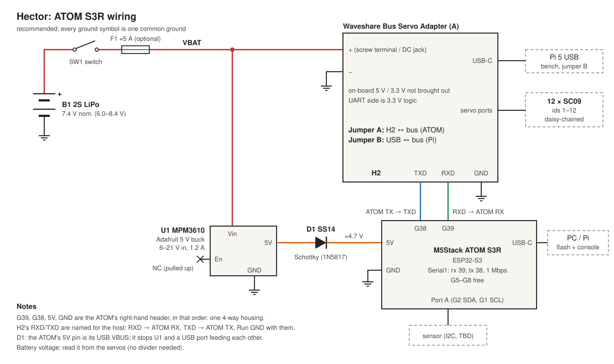

## Wiring: ATOM S3R

The ATOM talks to the bus over a GPIO UART into the adapter's UART header (H2), with the adapter's jumper in **A**. That leaves the ATOM's USB-C free for flashing and the console, even while it walks (tethered). The Pi's USB lead can stay plugged into the adapter: the jumper picks which one drives the bus (**A** = H2, the ATOM; **B** = USB, the Pi).

### Wires

| From | To | |
|---|---|---|
| battery + | SW1, F1, then adapter + **and** U1 Vin | VBAT, 20 AWG or thicker to the adapter |
| battery − | adapter − **and** U1 GND | |
| U1 5V | D1 anode | |
| D1 cathode | ATOM 5V | about 4.7 V |
| U1 GND | ATOM GND | |
| ATOM G38 (TX) | H2 TXD | |
| ATOM G39 (RX) | H2 RXD | |
| ATOM GND | H2 GND | run it with TX and RX |
| U1 En | nothing | pulled up to Vin on the breakout |

G39, G38, 5V and GND are the ATOM's right-hand header, in that order, so a single 4-way housing takes all of them. That leaves Port A (Grove: G2 SDA, G1 SCL, 5V, GND) for the sensor, and G5–G8 on the other header free.

H2 is a 3-pin header, GND, RXD, TXD. The names are from the host's side, so it's RXD to RX and TXD to TX, not crossed ("RX-RX, TX-TX" in Waveshare's wiki). If nothing replies, swapping them does no harm.

In code: `Serial1.begin(1000000, SERIAL_8N1, 39, 38);` (rx, tx).

### Why

- **The ATOM needs the buck.** Its 5V pin goes straight to its 5 V rail (the same net as USB VBUS, behind a 6 V polyfuse) and from there to a 5.5 V-max 3.3 V regulator, so 8.4 V from the battery would kill it. The adapter does have a 5 V buck and a 3.3 V regulator on board, but only for its own logic: they aren't brought out. U1 (the MPM3610 in the parts list) takes 6–21 V and gives 5 V at 1.2 A, plenty for the ATOM and a sensor.
- **D1** (any small Schottky, e.g. SS14 or 1N5817). Because the ATOM's 5V pin is its USB VBUS, with the battery on and USB plugged in, U1 and the computer's USB port would be wired together. With D1, U1 gives about 4.7 V; USB's 5 V wins when it's plugged in and D1 blocks it from feeding back into U1. Without D1, never plug USB in with the battery on.
- **No level shifting.** The adapter's UART side is 3.3 V (74LVC1G125/126 buffers on its own 3.3 V regulator), the same as the ESP32-S3. While the ATOM is resetting and G38 floats, the adapter's transmit enable is pulled off, so the bus just stays in receive.
- **Not the USB port.** The ATOM's USB-C is its only way to flash and see a console. Using it for the bus would mean USB host mode and a CH343 driver on the ESP32-S3, and unplugging the adapter every time you flash.
- **Battery voltage** comes from the servos' voltage register (0x3E, as `stat` and `check_servos()` read it), so no divider on an ADC pin. 2S is low at about 7.0 V under load.
- **SW1 and F1.** SW1 (or an XT30 plug) switches the servos and the ATOM together; it carries all the servo current, so a few amps. F1 is optional, but a LiPo will melt wire in a short, and the wiring cage is tight; about 5 A (the adapter is rated 6 A).

### Bringing it up

1. Before connecting the ATOM: battery on, check U1 + D1 give about 4.7 V, positive on the D1 cathode side. U1 has no reverse-polarity protection (the adapter does).
2. Connect the ATOM. It should boot from the battery, with or without USB.
3. Jumper to A, then flash `atom/` (see the README) and `ping` (2026-10-02: all 12 servos replied, with USB powering the ATOM and the buck's 5V lead off while D1 was on order; D1 was fitted by 2026-10-05).
4. Back to the Pi: jumper to B. The ATOM can stay wired.

### Sources

- [ATOM S3R](https://docs.m5stack.com/en/core/AtomS3R): [schematic](https://m5stack-doc.oss-cn-shenzhen.aliyuncs.com/680/Sch_M5_AtomS3R_v0.4.1.pdf), [pin map](https://m5stack-doc.oss-cn-shenzhen.aliyuncs.com/680/C126_PinMap_01.jpg)
- [Bus Servo Adapter (A)](https://www.waveshare.com/wiki/Bus_Servo_Adapter_(A)): [schematic](https://files.waveshare.com/wiki/Bus_Servo_Adapter_A/Bus_Servo_Adapter_A.pdf), [wiring example](https://docs.waveshare.com/Bus_Servo_Adapter_A/Product-Wiring-Example)
- [MPM3610 breakout](https://www.adafruit.com/product/4739): [PCB files](https://github.com/adafruit/Adafruit-MPM3610-PCB) (pins GND, 5V, Vin, En; En pulled up to Vin)
